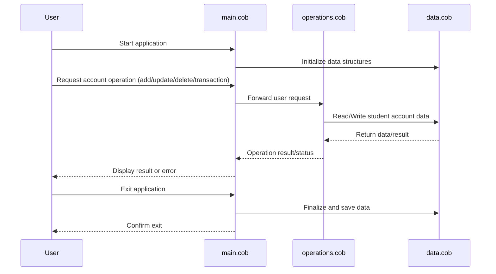

# COBOL Student Account System Documentation

This project contains COBOL source code for managing student accounts. Below is an overview of each COBOL file, their key functions, and business rules implemented in the system.

## File Overview

### 1. `main.cob`
- **Purpose:** Entry point of the COBOL application.
- **Key Functions:**
  - Initializes the program and sets up the environment.
  - Calls other modules (such as `operations.cob`) to perform business logic.
  - Handles program termination and error reporting.
- **Business Rules:**
  - Ensures the application starts with a clean state.
  - Manages the main control flow for student account operations.

### 2. `operations.cob`
- **Purpose:** Contains the core business logic for student account management.
- **Key Functions:**
  - Add, update, and delete student accounts.
  - Process transactions related to student accounts (e.g., deposits, withdrawals, balance checks).
  - Validate input data and enforce business rules.
- **Business Rules:**
  - Only valid student IDs can be used for account operations.
  - Transactions must not result in negative balances.
  - Updates to student records require proper authorization.

### 3. `data.cob`
- **Purpose:** Defines the data structures and storage for student accounts.
- **Key Functions:**
  - Declares record layouts for student account information.
  - Manages in-memory or file-based storage of student data.
- **Business Rules:**
  - Student account records must include unique IDs, names, and balance fields.
  - Data integrity is maintained through validation and structured storage.

## Business Rules Summary
- Student accounts must have unique identifiers.
- All transactions are validated to prevent overdrafts.
- Only authorized operations are permitted on student records.
- Data is structured and validated for consistency and integrity.

---

## Sequence Diagram: Student Account System Data Flow

---
For more details, refer to the source code in the `/src/cobol/` directory.
